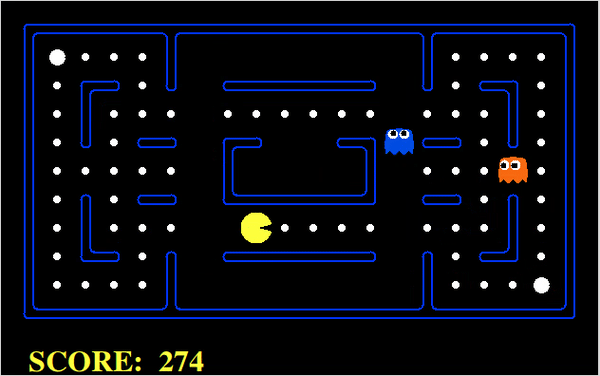

# Pacman_RL_with_feedback
Reinforcement learning (Q learning with function approximation) with human feedback implemented in Pacman environment

## About
This work is built upon the UC Berkley's Pacman environment (http://ai.berkeley.edu/home.html).
To teach Pacman to play the game, we design features (described below) and use function approximation for Q learning algorithm. Human feedback can be provided using these features to guide agent's learning. The agent can correct underperforming behavior and learn about unseen situations from good feedback. In 6 trial runs with total of 18 episodes with and without feedback, we recorded an average reward improvement of about 20 percent using the feedback mechanism

## Demo after learning with Feedback

## Setup
Requires Python2

## Usage instructions
* Move into src directory using "cd src"
* Normal Pacman game can be run using "python2 pacman.py"
* To let Pacman train and show what it learnt use: "bash run_q_learning.sh" or "python2 pacman.py -p ApproximateQAgent -a extractor=SimpleExtractorPellet -x 10 -n 11 -l mediumClassic"
* To run the program with feedback mode enabled use: "bash run_feedback_mode.sh" or "python2 pacman.py -p ApproximateQAgentFeedback -a extractor=SimpleExtractorPellet -x 0 -n 4 -l mediumClassic"

## Experiments with feedback

* Option: Read from file - is for loading feature weights from previous run
* Option: Write to file - is for storing weights after runs to read next time
* Option: Explore - to choose a random action with a probability (Required for learning).
* Option: Use queries - to give feedback for next 3 games

1. Use f, t, t, f to run with exploration, without feedback and write weights to file. (We used this for 3 episodes to allow agent to learn some basic rules)
2. Use t, f, f, t to load weights and use feedback without exploration. (We used this for 4 episodes to test feedback mechanism)
3. Use t, f, f, f to load same weights and run without feedback or exploration. (We ran this 4 times as well)

Comparision of performance in 2 and 3 will show the effect of using feedback.

The results of our experiments are documented in results.txt

## Feedback mechanism

We have provided additional features to incentivize Pacman to hunt and eat scared ghosts in this program.
Feedback can be provided by adding/decreasing importance of following:
1. bias
2. run into scared ghosts 1 step away
3. run into non-scared ghosts 1 step away
4. eat food
5. distance to closest food
6. hunt scared ghost

To increase importance of a feature use *+*, to decrease importance use *-*.

For example:  
* 6 + (Increase importance of hunting scared ghost)
* 3 - (Increase importance of running from normal ghost)
* -1 -1 (End of feedback)
